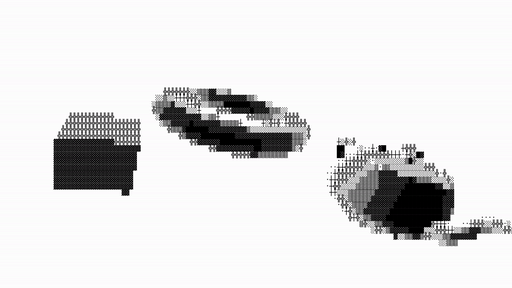

# ASCII 3D Renderer for JavaScript



This repository contains sample code written for [blog post](https://kciter.so/posts/ascii-3d-renderer/) (Korean).

You can watch the example at this link: https://6637eb83d047d2bb1b3cfe67-nhlvitxryq.chromatic.com/

## Run
```bash
pnpm install
pnpm run storybook
```

## License
MIT
